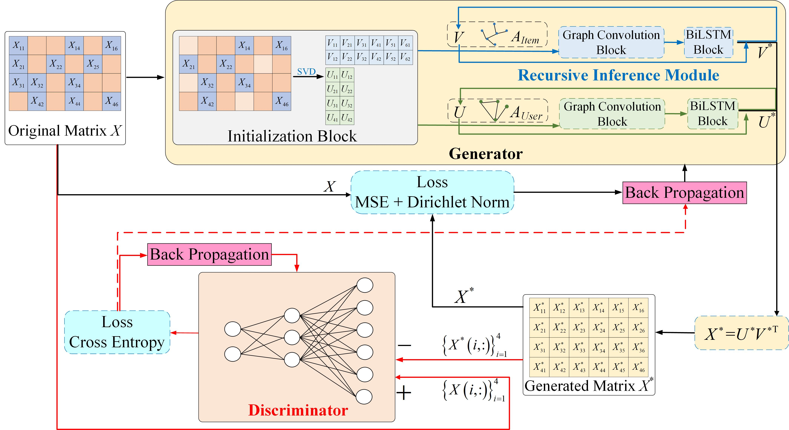
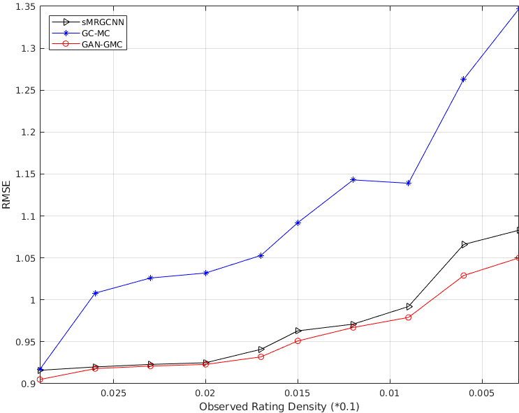

<h1 align = "center">GAN-GMC: Multi-Graph Representation Learning with GANs for Geometric Matrix Completion</h1>

<h1 align = "center">Abstract</h1> 

Existing methods for Geometric Matrix Completion (GMC) with Graph Neural Networks (GNNs) rely heavily on a considerable amount of observed ratings and favorable GNN models that are resistant to over-smoothing issues. To obtain an accurate rating matrix, it is vital to extract good latent feature representations of users and items by utilizing the pairwise graph relationships between users/items. In this paper, we propose an innovative multi-graph representation learning framework with Generative Adversarial Nets (GANs) for GMC, which can empower deep GNNs to be capable for extracting user and item embeddings with very few observed ratings. Specifically, new rating scores generated by a generator G, combining graph convolutional networks and bi-directional LSTMs for facilitating deep recursive inference to avoid over-smoothing, are viewed as ``fake'' samples to fool a discriminator D that tries to detect whether the rating scores are from the ground truth rating matrix or generated by G. With the competition between the two modules, both of them can alternately and iteratively boost their performance. We evaluate our proposed model on several standard datasets, showing that it outperforms the state-of-the-art approaches, even with very few training samples. We find empirically that GNNs in our framework can resist effectively over-smoothing problem.

<h1 align = "center">Motivation</h1>

Recently, graph convolutional networks (GCN) have attracted much attention in light of their favorable performance on many graph data modeling tasks. Existing methods for GMC problems with GNN/GCN usually build learning modules to extract the latent feature representations of users and items and then reconstruct a new rating matrix based on the corresponding embeddings. However, this methodology relies heavily on an amount of observed ratings and existing favorable GNN models. Firstly, the observed rating matrix may be extremely sparse (training samples are very few) in real applications, which degrades the performance of completion. Meanwhile, existing favorable GNNs are kind of shallow model (no deeper than 3 or 4 layers) because of the over-fitting and over-smoothing problems caused by the increase of GCN layers, which inherently limits the expressive power of the GCNs.

To address the above issues, we propose a novel multi-graph representation learning framework with GANs to solve GMC problem termed GAN-GMC, which unifies a generator G and a discriminator D. G generating the missing entries conditioned on what is actually observed and a discriminator D estimating the probability that a rating score came from the training rating matrix rather than G. Specifically, new rating scores generated by G are viewed as ``fake'' samples to fool the discriminator D, while D tries to detect whether the rating scores are from ground truth rating matrix or generated by G. With the competition between the two modules, both of them can alternately and iteratively boost their performance. Further, we develop a deep recursive inference module for both user and item graph representation learning in generator, which can avoid the over-fitting and over-smoothing problems caused by the increase of GCN layers.

<h1 align = "center">Overview</h1>

    

<small> Figure 1. The overall structure of our GAN-GMC. </small>

To better understand the proposed model, we provide a summary of the algorithm flow: It contains two key components: 1) Generator G consists of a initialization block and a deep recursive inference module. The initialization block randomly remove the observed ratings from original rating matrix X and then obtains the initial representations of users and items by SVD on updated rating matrix X. Then the two initial representations are fed to the deep recursive inference block to obtain more accurate representations. 2) Discriminator D is a multilayer perceptron to detect whether the rating scores are from the ground truth rating matrix or generated by G. Performance of both G and D can be boosted after the competition between them.

<h1 align = "center">Experiments</h1>

## Robustness Analysis.

To further demonstrate the advantage of our proposed framework, we evaluate the proposed approach in comparison with baselines sRMGCNN and GC-MC by performing different setting of the density of observed ratings. Specifically, we compare the three models on Flixster dataset under low observed rating density, that can lead to potential perturbations and affect the completion performance. We adopt ten different observed rating densities in [0.0003,0.0029] to train these models. The experimental results show that the RMSE scores of the baselines increase quickly with decreasing observed rating densities, while our GAN-GMC performs robustly even when the observed rating density is extremely low. Overall, the robustness of GAN-GMC gives credits to its superiority in dealing with real-world applications where the underlying rating matrix has very few entries.

    

<small> Figure 2. RMSE for sRMGCNN, GC-MC, and GAN-GMC on Flixster with different observed rating densities. </small>

<h1 align = "center">Conclusion</h1>

We propose a novel multi-graph representation learning framework fusing GNNs and GANs for solving GMC problem. To the best of our knowledge, this is the first work to develop a data-driven GMC methodology taking advantages of GNN for extracting node-level representation but without suffering from over-smooth issue, while at the same time, GAN’s good potential in generating new samples via an adversarial process. Experimental results verify the merits of our propose method, especially when very few training samples are given for GMC. Theoretical study on the expressive power of the proposed model and further extensions of the current framework (with more advanced variants of GNNs and/or GANs) are highly expected in the future work.

